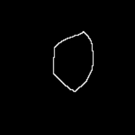

Automated calculation of radius of curvature of cytoplasmic membrane
===

||||
|-------------------------------------|-----------------------------------|-----------------------------------|-----------------------------------|
|**ORIGINAL 3D CELL**   |**IDENTIFIED "BEST" SLICE**   |**AUTOMATED DETECTION OF THE SEGMENTS**   |**AUTOMATED CALCULATION OF THE RADIUS OF CURVATURE**   |

**Authors**
--

|    ||
|-----------------------------|------------|
|**CLUET David**|     [david.cluet@ens-lyon.fr](david.cluet@ens-lyon.fr)|

License
--

Copyright CNRS 2013

>This software is a computer program whose purpose is to **automatically identify segments of the cytoplasmic membrane and calculate their radius of curvature**.
>
>This software is governed by the CeCILL  license under French law and abiding
by the rules of distribution of free software. You can use, modify and/ or
redistribute the software under the terms of the CeCILL license as circulated
by CEA, CNRS and INRIA at the following URL:
http://www.cecill.info/index.en.html
>
>As a counterpart to the access to the source code and  rights to copy, modify
and redistribute granted by the license, users are provided only with a limited
warranty  and the software's author,the holder of the economic rights, and the
successive licensors have only limited liability.
>
>In this respect, the user's attention is drawn to the risks associated with
loading, using, modifying and/or developing or reproducing the software by the
user in light of its specific status of free software, that may mean  that it
is complicated to manipulate, and that also therefore means  that it is
reserved for developers  and  experienced professionals having in-depth
computer knowledge. Users are therefore encouraged to load and test the
software's suitability as regards their requirements in conditions enabling
the security of their systems and/or data to be ensured and, more generally,
to use and operate it in the same conditions as regards security.
>
>The fact that you are presently reading this means that you have had knowledge
of the CeCILL license and that you accept its terms.

**Requirements**
--
The `FIND_CURVE` macro requires `ImageJ v1.49g` or higher ([Download](https://imagej.nih.gov/ij/download.html)).

For ImageJ, the conversion of the analyzed stacks into animated GIFs requires the ([Gif-Stack-Writer Plugin](https://imagej.nih.gov/ij/plugins/gif-stack-writer.html)).

**Files**
--
- [] **src**
    - README.md
    - LICENSE
    - `Installation.ijm`
    - `Installation_FIJI.ijm`
    - [] **doc**
        - *3D.jpg*
        - *FIJI.jpg*
        - *Identification.jpg*
        - *IJ.jpg*
        - *Logo_cnrs.jpg*
        - *Logo_ens.jpg*
        - *Logo_LBMC.jpg*
        - *Segment.jpg*
        - *Slice.jpg*
    - [] **macro**
        - `CleanMemory.java`
        - `CloseImage.java`
        - `CNRS.jpg`
        - `ENS.jpg`
        - `Explorer.java`
        - `Find_Curve.java`
        - `HTML_Curve.html`
        - `LBMC.jpg`
        - `macro_AboutPlugin.java`
        - `Main.java`
        - `ROIeraser.java`
        - `Startup_CL.txt`
        - `style_Curve.css`
        - `tableline.html`
        - `Trigo.tif`
        - `UCBL.jpg`

**Installation**
--
The `FIND-CURVE` macro can be automatically installed with all required files in `ImageJ` and `FIJI`. Please follow the specific instructions described below.

---
1. Open `ImageJ`.
2. Open the `src` folder of the `FIND-CURVE` macro.
3. Drag the `Installation.ijm` file on `ImageJ` Menu bar to open it.
4. In the Menu bar of the macro select the `Macros/Run Macro` option.
5. The window will be closed automatically and all required files will be installed in the `ImageJ/macros/Find-Curve` folder. The shortcut `Plugins/Macros/FIND-CURVE` will be added in the Menu bar.
6. Restart `ImageJ` to refresh the Menu bar.

---
1. Open `FIJI`.
2. Open the `src` folder of the `FIND-CURVE` macro.
3. Drag the `Installation_Fiji.ijm` file on `FIJI` Menu bar to open it.
4. In the console select the `Run` option.
5. All required files will be installed in the `Fiji.app/macros/Find-Curve` folder. The shortcut `Plugins/Macros/FIND-CURVE` will be added in the Menu bar.
6. Restart `FIJI` to refresh the Menu bar.

Update
---
Follow the same instructions as for the installation process.
